# 1 - 555 Timer

## Components
- $1$ x Breadboard
- $3$ x NE555 Timer
- $3$ x LED
- $1$ x $1 \ M \Omega$ Potentiometer*
- $4$ x $1 \ k \Omega$ Resistors
- $1$ x $100 \ k \Omega$ Resistor
- $1$ x $1 \ M \Omega$ Resistor
- $3$ x $470 \ \Omega$ Resistor (or similar resistance)
- $2$ x $0.1 \ \mu F$ Capacitor
- $3$ x $0.01 \ \mu F$ Capacitor
- $1$ x $5 \ V$ source (I use Analog Discovery 2) 
- $1$ x SPDT switch
- Jumper wires

###### \* I did not have a potentiometer large enough, so a resistor is sufficient here.

## Astable Timer

### Overview
The first component we'll make is the clock. I recommend referring to reference $[1]$, as it was used as a walkthrough for this part. Ben Eater in his videos uses an LM555 timer. I was able to find some NE555 timers that work just as well. The schematic I used is in $[2]$.  Here, the following schematic is given:

<br />
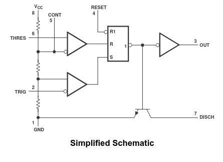
<br />

Keep in mind this is only a simplified schematic. We see some resistors, two comparators, an SR latch, a transistor, and an inverting buffer. The resistors are each $5 \Omega$, causing speculation to the name of the 555 timer. By the voltage division principle, the top comparator receives $\frac 23 V_{CC}$ and the bottom comparator receives $\frac 13 V_{CC}$. You may notice pin $5$ CONT is attached to the top comparator. The datasheet explains this is used to alter the voltage division. We'll ignore that for now.

The bottom comparator can set the SR latch (setting it high) while the top resets it (setting it to low). RESET can override this when supplied voltage. The resulting output of the SR latch feeds to the output of the timer itself. Finally, there's a transistor at the bottom connecting DISCH to GND controlled by the inverted output of the SR latch.

The schematic refers to some of the pins, which are better outlined later in the datasheet:

<br />
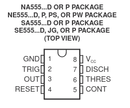
<br />

As a quick overview, pin $1$ is GND and $8$ is supplied voltage $V_{CC}$. Pin $2$ is labeled as TRIG, what we supply to the bottom comparator's negative terminal. Pin $6$ is the top comparator's positive terminal connection.  Pin $3$ is OUT, connected to the output of the SR latch. Pin $7$ is the discharge pin that will connect to GND depending on the output of the SR latch. Pin $4$ is RESET, which we saw can override the reset of the SR latch. Pin $5$ is CONT, which we observed earlier.

### Explanation
Now, what we're interested in is a clock that constantly goes on and off. That is, an astable timer. "Astable" meaning not stable - it will keep switching between high and low. Fortunately, there is a diagram within the datasheet that illustrates how to make an astable timer:

<br />
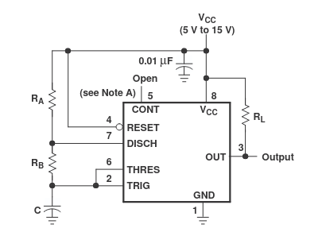
<br />

This is akin to the implementation in [1], with the addition of the resistor $R_L$ between pins $3$ and $8$. We'll discuss this discrepancy later.

For now, let's review what's going on. Pins $2$ and $6$ are connected to each other, which are subsequently connected externally to a capacitor $C$. $C$ will gather charge from $V_{CC}$ as the voltage goes through $R_A$ and $R_B$. 

In the beginning, $2$ and $6$ are low, causing the SR latch to be high and turning the transistor off, consequently cutting off DISCH from GND. Here's a horrible demonstration in Debian paint:

<br />
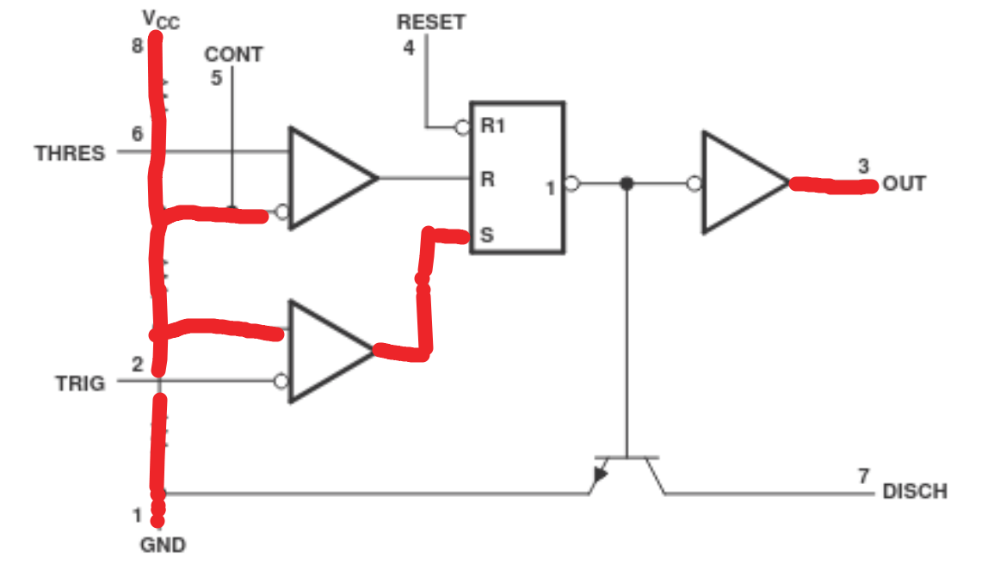
<br />

As current flows into the capacitor, slowly pin $2$ will increase voltage until it gets past $\frac 13 V_{CC}$, setting the bottom comparator low. This won't do anything to the output of the SR latch as both S and R will be low, preserving the state. Of course, pin $6$ also receives this voltage level, but it's still less than $\frac 23 V_{CC}$, so the top comparator is still low.

It gets more interesting when the capacitor fills up more and we reach that $\frac 23 V_{CC}$. Pin $6$ gets to set the top comparator to high, enabling the SR latch to reset, making its output low. Now the transistor receives a high output, allowing pin $7$ DISCH to flow to GND. Here's my pitiful attempt at showing this:

<br />
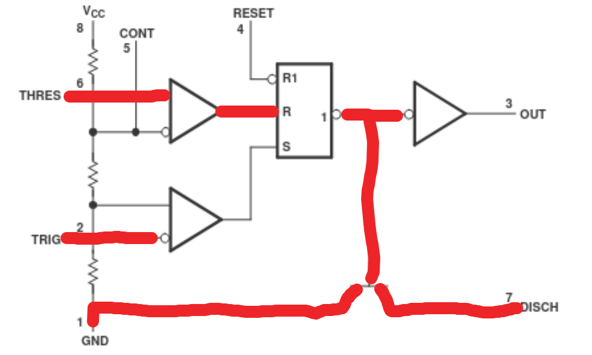
<br />

With pin $7$ now connected to GND, the capacitor $C$ will start discharging. Pin $6$ (and pin $2$) will drop below $\frac 23 V_{CC}$, making both set and reset low and hence staying at a high output. It isn't until pin $2$ (and yes, pin $6$) drops below $\frac 13 V_{CC}$ that the SR latch will finally have a low output and prevent the transistor from connecting DISCH to GND. The capacitor will start charging again, and the cycle repeats.

### Explaining the Rest

Remember how I mentioned the beginning schematic was only simplified? Wikipedia notes the 555 timer actual schematic is typically:

> 25 transistors, 2 diodes, and 15 resistors

This is important because of the discrepancy for the $R_L$ placement between the schematic and Ben Eater's video. By attaching pin $3$ -> GND, you are sourcing current, ie. current is coming out of the 555 timer to GND. Ben puts an LED between pin $3$ and the resistor to see what's happening, and as the timer outputs high, the LED is high and lights up, as you'd expect. If instead we follow the schematic and connect $R_L$ to $V_{CC}$, we are sinking the current, meaning it'll go into the 555 timer. Now OUT's passive state is high.

Being a novice in this stuff, I thought this would just lead to problems. The schematic shows what looks to be a digital buffer, which I thought was just one-way. Surely applying voltage to the output just keeps the output permanently high? It turns out, if we think of it as just a bunch of resistors and transistors, the 'sinking' and 'sourcing' of current makes more sense. It's less about supplying a voltage in to get a voltage out. Instead, transistors are like switches, and all the 555 timer is doing is receiving input that will dictate whether to *switch* the output state from what it currently is. Maybe that's obvious (or conversely too deep into the rabbit hole), but I needed that clarity.

> [!NOTE] If you decide to sink current instead, make sure to change the direction of the LED. If you didn't know LEDs have a certain direction...now you know. There's a straight edge on the LED to designate it.

What about pins $4$ and $5$? They're honestly pretty useless. Here's what the datasheet has to say about them:

```
To prevent false triggering, when RESET is not used, connect RESET to VCC
```
```
Decoupling CONT voltage to ground with a capacitor can improve operation. This should be evaluated for individual applications
```

This is why in the diagram you actually see pin $4$ connected to $V_{CC}$, and this is what we intend to do. For pin $5$, Ben uses a $0.01 \mu F$ capacitor, which is fine for our use.

Notice also a $0.01 \mu F$ capacitor in the Astable diagram. There is a note about this too:

```
A bypass capacitor is highly recommended from VCC to the ground pin; a ceramic 0.1μF capacitor is sufficient.
```

Ben demonstrates this well in $[1]$. This is mainly to reduce noise.

This covers most of it. See $[1]$ for the essentials and $[2]$ for a supplemental primary source. For those that want to go deep into the weeds, the Wikipedia article $[3]$ can probably satisfy your curiosity. Now onto making the actual circuit.

### Building

Quick disclaimer before we begin. I use the schemdraw Python library for my visuals. There are severe limitations, as I'll repeatedly note. Trust me, this is better than my original plan to show you pictures of my breadboard. In practice, I'm just Frankenstein-ing from a bunch of kits I have lying around, and the components and wires are sticking out everywhere.

Also, I neglect to leave space for $V_{CC}$ and GND. It can be really be connected to any of the four far edge columns, but be mindful in your actual design.

The first thing to do is put the 555 timer on the breadboard. I will illustrate this with the schemdraw Python library:

<br />
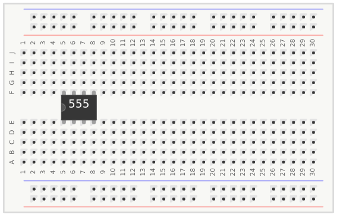
<br />

The main thing is that there's a little circle at the corner of the timer, which is not depicted in the image above. This circle represents that the corner-most pin closest to the circle is pin $1$.

Next is to attach GND and $V_{CC}$. At least, we'll attach pins $1$ and $8$ to their respective terminals on the breadboard, and actually supply GND and $V_{CC}$ at the end.

<br />
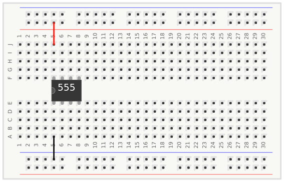
<br />

If you don't have these terminals, you can tie GND / $V_{CC}$ directly to the pins or indirectly on one of the bare rows. I did so as my first attempt, and later decided buying some boards with $+/-$ ends is worthwhile.

> [!NOTE] For absolute beginners, don't pay too much attention to the colors of the jumper wires. The colors have no meanings, although I will try to implement intuitive coloring like black wire for GND connections.

You may recall that pins $2$ and $6$ were connected together with a capacitor $C$ to GND. That will be the connections we make next, where I will attach a $1 \ \mu F$ capacitor.

<br />
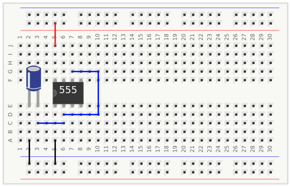
<br />

> [!NOTE] The pictorial elements in the schematics library in Python has limitations on its designs. The capacitor here could be directly from pin 2 to GND, but since it can't stretch its leads, and to keep the timer visible, an intermediate wire was added.

We can attach $R_A$ from $V_{CC}$ to pin $7$ and then $R_B$ from pin $7$ to pin $6$. Here, we have $R_A = 1 \ k \Omega$ and $R_B = 100 \ k \Omega$.

<br />
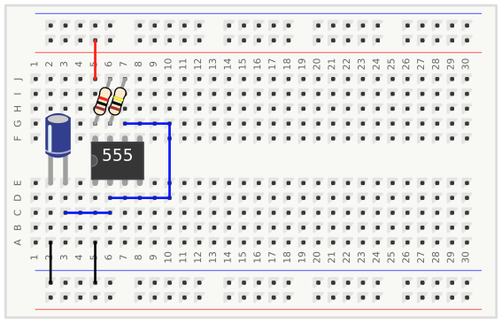
<br />

We're done! But we want to see the output, so as Ben does in $[1]$, we'll attach an LED in series with a resistor ( $470 \ \Omega$ ) to GND. Ben's video shows him using a slightly different resistance, but it doesn't affect performance.

<br />
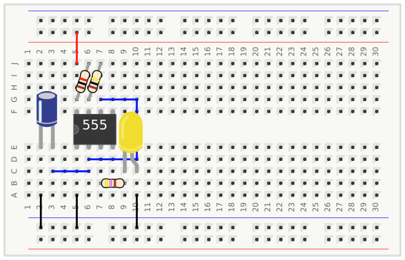
<br />

If you were following along with my explanations, you also know we want to attach pin $4$ to $V_{CC}$ to prevent any unwanted resets, and a capacitor (we'll use $0.01 \ \mu F$) from pin $5$ to GND. Then a second capacitor (which we use $0.1 \ \mu F$) between $V_{CC}$ and GND.

<br />
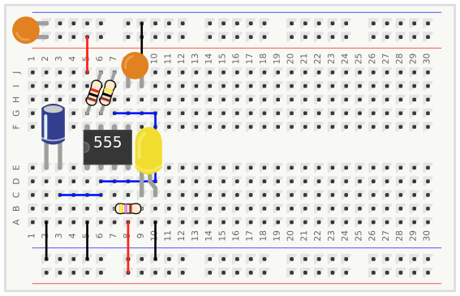
<br />

Ben uses a potentiometer, but none of my kits have one with enough resistance to slow down the timer sufficiently. There isn't much application for this, and we can manually replace $R_B$ anyways, so I'm not going to the store for a dumb potentiometer.

Now we're truly done. You can apply the voltage source $V+$ and GND now. I use an Analog Discovery 2 from my ol' college days that I always told myself I'd use.

## Monostable

Truth be told, this part is optional if all we care about is a working clock. However, Ben uses it in the event he wants to step through one clock cycle at a time $[4]$. We'll do the same.

### Explanation

Again, the schematic shows how to make a monostable timer:

<br />

<br />

We can use a button to connect to TRIG, supplying voltage when not pressed and connecting GND when pressed. When pressed, TRIG is low, and therefore the bottom comparator is high, setting the latch (OUT high). This will also prevent any discharge of the capacitor attached to pin $6$ and pin $7$.

<br />

<br />

At this point, when the button has been released, the top comparator in the timer will send a high signal. Of course, $C$ charges and it takes some time before THRESH is high, but in the meantime S and R are low, preserving the state, which is key for the concept of **debouncing** discussed later. R becomes high, enabling the transistor and connecting DISCH to GND. Eventually the top comparator will turn low, but the bottom comparator stays low, so the output remains low.

<br />

<br />

You may think why not just connect a button to an LED without a timer? That would work, but the entire point is to prevent debouncing. That is, to prevent multiple signals being interpreted over one button press. The intent is to intentionally step through one clock cycle at a time. If it bounces two or more clock cycles when we attempt to debug something, it could mean undoing everything we did to get to that point to try again.

Think of the time when $C$ is charging and discharging to be the 'buffer' time between changed states. During this time, any changes to the state have no effect, and therefore debouncing the circuit.

### Building
Let's start with the button to put good distance between our two timers. We'll attach the button to GND on one pin and in series with a resistor - $1 \ k \Omega$ - to our voltage source.

<br />
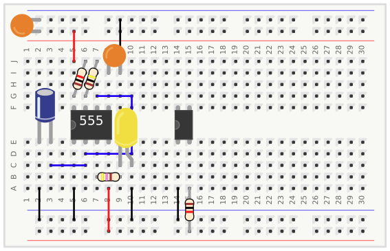
<br />

Python's `schematic.pictorial` module does not readily support a button, so let the four pin chip act as the button. Just go with it.

We'll now place the timer, where we can connect it's pins $1$ and $8$ to GND and $V_{CC}$, respectively. We'll also attach the button to pin $2$.

<br />
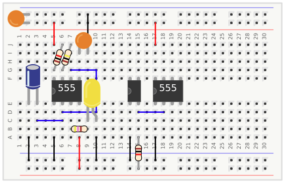
<br />

We'll now connect pins $6$ and $7$ together, with $R_A$ between $7$ and $V_{CC}$. We'll go with Ben's video and choose $R_A = 1 \ M \Omega$. Then we'll connect a capacitor ($0.01 \ \mu F$) between pin $6$ and GND.

<br />
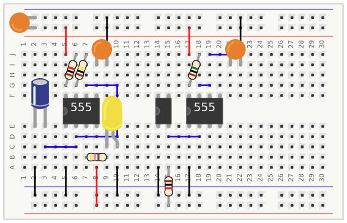
<br />

That's it! Even easier than the astable timer. We can now connect the LED to pin $3$ with another $470 \ \Omega$ resistor to GND, connect pin $4$ to $V_{CC}$, and pin $5$ with a $0.1 \ \mu F$ capacitor.

<br />
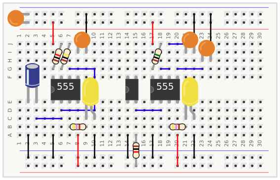
<br />

## Bistable

The bistable timer is easy if you've been following along. We want to *switch* between stable states, so we're going to use - a switch. This time, the schematic doesn't show us what to do, but Ben Eater does a good explanation of the whole process $[5]$. Essentially, we will use yet another 555 timer to debounce the switch. As Ben puts it, the SR latch is enough to achieve this.

### Explanation
Unfortunately my attempts at making a schematic are terrible, and I recommend to go to $[5]$ for a visual. All we're doing is attaching pins $2$ and $4$ to the switch so we can trigger and reset the timer. TRIG is connected to the negative terminal of the comparator, and pin $4$ resets the SR latch if voltage is applied. So we'll initially tie both to voltage with resistors, then connect them to the switch.

We'll have a 3 pin switch called a SPDT switch. Since pins $2$ and $4$ are being connected to voltage, the switch's center pin will connect to GND and force the respective 555 timer pin low. 

### Building

Let's do exactly as we described. We'll add a 555 timer and connect pins $2$ and $4$ to $1 \ k \Omega$ resistors, each connected to $V_{CC}$. As before, we'll also connect pins $1$ and $8$ to GND and $V_{CC}$, respectively.

<br />
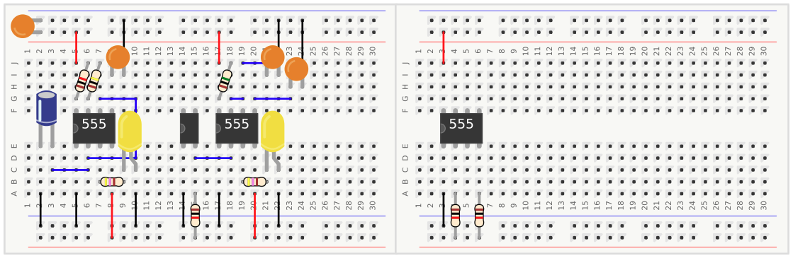
<br />

Now we'll add the switch. One end will be connected to pin $2$, the other to pin $4$. The center pin will go to GND.

<br />
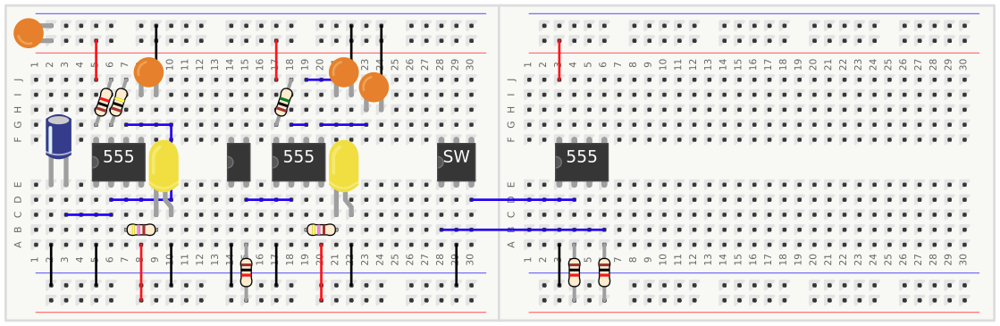
<br />

And we're done! But we'll be safe and do some necessary precautions. We should ensure pin $6$ is grounded (possibly pin $7$ too, but this is just discharge and doesn't play a part, so Ben ignores this, and we will too). Connect pin $5$ with a capacitor ( $0.1 \ \mu F$ ), then add the LED and $470 \ \Omega$ resistor to GND.

While we're at it, in the Python diagrams I neglected attaching all the terminals to each other. From this point on (and the last image), the 555 timer was shifted to allow $V_{CC}$ and GND continuations for the second breadboard. I also lazily attached $V_{CC}$ and GND terminals together for the first breadboard. Deal with it.

<br />
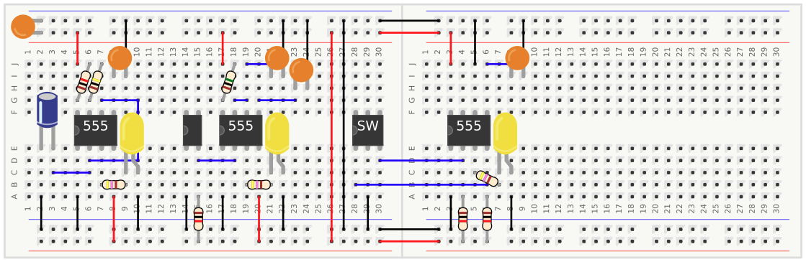
<br />

## Combining the Pieces

### Overview

Now we can use logic to piece everything together. Ben explains this well in $[6]$. Essentially the switch, or bistable mode, acts as a logical 2-input multiplexer, picking one state when high and another state when low. A 'halt' is added, I suppose if switching to our monostable input isn't sufficient, but we'll add it regardless. Below is the logic we'll implement:

<br />
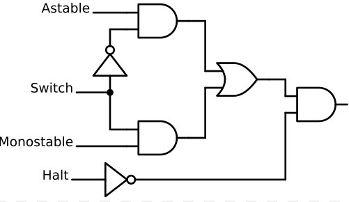
<br />

At least, this is Ben's design. This will be one of the few main digressions from the videos - I won't be adding the Halt portion. This completely eliminates the NOT gate and the AND gate at the end, making this process much simpler. In fact, a multiplexer chip would simplify things greatly, but in the spirit of trying to mimic the video (and because I already ordered the SN74LS series chips), we'll proceed with basic logic gates. 

Logic gates are very simple to implement. Here's the datasheets for the NOT, AND, and OR gates ( $[7] [8] [9]$ ):

### NOT

<br />
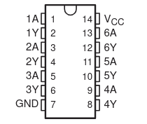
<br />

### AND

<br />
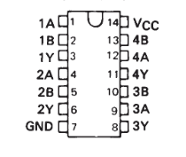
<br />

### OR

<br />
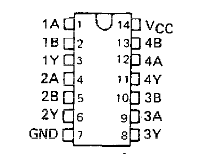
<br />

Some datasheets will even show the logic gates within the chip, which I find intuitive. Regardless, inputs and outputs are generally on the same side, and the output pin is directly below the last respective input pin. You can infer that A or A/B are inputs, and Y is the output, with the numbers designating each gate. $1A$ is the input for a NOT gate, and outputs to $1Y$.

In $[6]$, Ben also points out that more optimal circuit designs exist. We'll keep this unoptimized.

### Building

There's not much to clarify here, as translating a logical circuit diagram to the breadboard is relatively straightforward. We just ensure the output pins of the timers are used as input for the circuit.

Unfortunately, even in a nice Python schemdraw image, it's hard not to overlap wires. This is one of those occassions where if you're following along, it's probably best to just refer to the logical diagram.

 Hopefully it's obvious that we will connect $V_{CC}$ to the $V_{CC}$ pins and GND to the GND pins. If all works well, we won't need the previous LEDs anymore either, so we'll take those out with their series resistor.

<br />
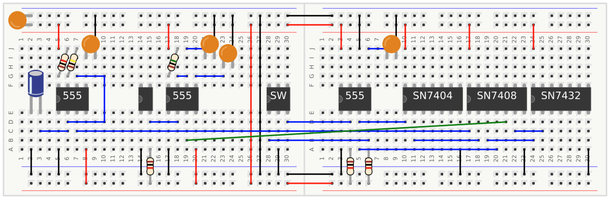
<br />

Can you tell I'm gradually adding more steps between each drawing as you, the reader, catch on to the basics? It's totally not because I'm getting tired of showing every individual step.

We'll demonstrate the output with an LED, of course in series with a $470 \ \Omega$ resistor. Of course, we've reached the last part and I have no way of putting the LED and resistor in the SN74LS32 1Y (pin 3) spot. Don't you just love when you put a lot of work into something and it just falls apart? Instead, have fun looking at my final design:

<br />
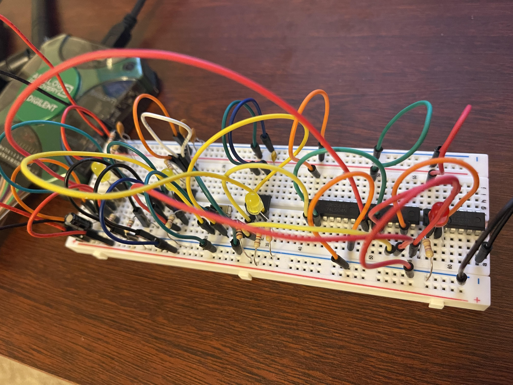
<br />

## Further Considerations

There's quite a bit we can optimize here. If we're not concerned at all with troubleshooting the clock cycles, we can remove 'Halt' and the Monostable timer completely (we've already removed 'Halt' in my design). Then there's no need for the Bistable implementation either, so we're just left with the Astable timer.

From the data sheet $[2]$, we get some useful calculations of the output-high level duration and low-level duration:
$$
t_H = \ln 2 \times (R_A + R_B) \times C \\
t_L = \ln 2 \times R_B \times C
$$

It makes sense that by using a smaller capacitor, the charging/discharging times would decrease, leading to a faster clock cycle. For charging and discharging, current passes through $R_B$, but only through charging does current pass through $R_A$, and hence affecting $R_B$ is more significant.

So the question becomes what is the smallest values of $R_A, R_B, C$ that remains tolerable? Well, the datasheet actually recommends not exceeding $100 \ MHz$, which is estimated under the following:

$$
f = \frac 1T ≅ \frac {1.44}{R_A + 2R_B × C}
$$

We could, say, use $R_A = R_B = 4.7 \ k \Omega$ and $C = 1 \ nF$. 

The datasheet recommends for larger frequencies to use the TLC555 timer, which can go somewhere around $2 \ MHz$ due to "high input impedence" $[10]$. That certainly is an improvement.

One glaring issue is that we're making a breadboard computer. If we were deciding to solder, we could go even further. A CMOS crystal oscillator could really speed things up, and likely something we should explore for taking this project further. Using FPGAs could get us to $>100 \ MHz$ speeds too. If we had our own semiconductor fab, we could reach a couple $GHz$, but maybe we'll stick to the more affordable options.

## References
[1] [Astable 555 timer - 8-bit computer clock - part 1](https://www.youtube.com/watch?v=kRlSFm519Bo) \
[2] [xx555 Precision Timers Datasheet](https://www.ti.com/lit/ds/symlink/ne555.pdf) \
[3] [Wikipedia - 555 timer IC](https://en.wikipedia.org/wiki/555_timer_IC) \
[4]  [Monostable 555 timer - 8-bit computer clock - part 2](https://www.youtube.com/watch?v=81BgFhm2vz8) \
[5] [Bistable 555 - 8-bit computer clock - part 3 ](https://www.youtube.com/watch?v=WCwJNnx36Rk) \
[6]  [Clock logic - 8-bit computer clock - part 4](https://www.youtube.com/watch?v=SmQ5K7UQPMM) \
[7] [SN74LS04 Hex Inverters Datasheet](https://www.ti.com/lit/ds/symlink/sn74ls04.pdf)\
[8] [SN74LS08 Quadruple 2-Input Positive-AND Gates Datasheet](https://www.ti.com/lit/ds/symlink/sn74ls08.pdf)\
[9] [SN74LS32 Quadruple 2-Input Positive-OR Gates Datasheet](https://www.ti.com/lit/ds/symlink/sn74ls32.pdf) \
[10] [TLC555 CMOS Timer Datasheet](https://www.ti.com/lit/ds/symlink/tlc555.pdf)